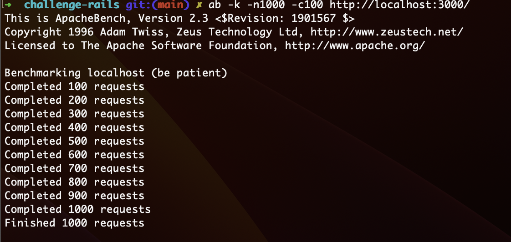
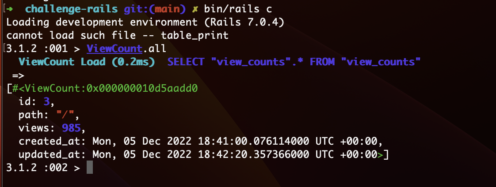
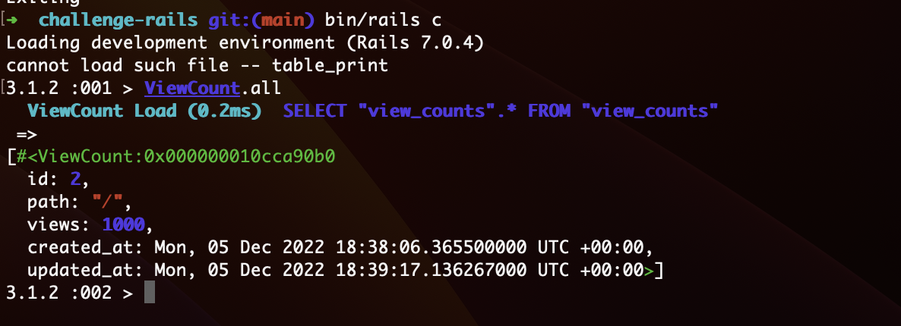

# README

# Tasks
- Implement a form (and the endpoint that receives the form) to create profiles [Commit Here](https://github.com/mayalces/challenge-rails/commit/dd60b39d9297ed3ada32874aaa520109d27914d6)
  - The migration to add the `profiles` table has already been created (`db/migrate/20220930174949_create_profiles.rb`), but it may need changes
  - Usernames may only contain alphanumeric characters and hyphens (-) [Commit Here](https://github.com/mayalces/challenge-rails/commit/5fd512a22484cb0f0603c172f7493d0a741b49e3)
  - Usernames should be unique [Commit Here](https://github.com/mayalces/challenge-rails/commit/064862de672aeda3d399c58693a5a224b901c77e)
  - This endpoint shouldn't allow the `superuser` flag to be set
- Implement a reports endpoint [Commit Here](https://github.com/mayalces/challenge-rails/commit/dd60b39d9297ed3ada32874aaa520109d27914d6)
  - Review (and fix) the database schema and migrations
    - The relation between profiles and repositories is 1:n [Commit Here](https://github.com/mayalces/challenge-rails/commit/540c5c6676482e8b3742d34c8481205dfc146dbc)
  - The migration to add the `repositories` table has already been created (`db/migrate/20220930175002_create_repositories.rb`), but it may need changes
  - The report presents each profile and each repository that profile has
  - Path to the endpoint is `/reports/`
  - The endpoint supports HTML (it displays all users and their repositories using any appropriate HTML elements and CSS styling) and JSON
  - The JSON response should be an array of objects, where each object has a `username` (`string`)property, and a `repositories` (`array`) property that is an array of objects that have `id` (`number`), `name` (`string`), `tags` (`string`) and `profile_id` (`number`) properties. E.g `[{"username":"eat-music-4","repositories":[{"id": 1,"name": "balance-mocha-6","tags": "linux,swift,mysql","profile_id": 1}}, ...]`
  - If a profile doesn't have repositories, the `repositories` attribute should be an empty array, e.g `{"username": "leopard-7","repositories": []}`
  - The endpoint receives an optional `tag` parameter which filters the response by users that have a repository with a given tag (the `tags` attribute is a comma separated list of words) **\***
    - Tags don't need to be an exact match. They should match when the tag contains the received `tag` parameter
  - No pagination required
- Implement the reports endpoint but with data fetched from "external" sources [Commit Here](https://github.com/mayalces/challenge-rails/commit/dd60b39d9297ed3ada32874aaa520109d27914d6)
  - No filtering required
  - No pagination required
  - Path to the endpoint is `/reports/external`
  - This is done in `ReportService#generate` (`app/services/report_service.rb`)
  - An `::External::Client` class has been provided as if it was a third party gem. This class doesn't need to be modified. It implements `#fetch_profiles` and `#fetch_repositories` methods that return an array representing a collection of profiles and repositories, respectively, obtained from an external service (the actual implementation just reads fixture files located in `lib/external/fixtures`)
  - In the tests, `::External::Client` should be treated as if it was contacting an external service through HTTP. That is, the original implementation of the `#fetch_profiles` and `#fetch_repositories` shouldn't be executed **\***
- Debug the ViewCount feature **\*** [Commit Here](https://github.com/mayalces/challenge-rails/commit/8ae03010b204efd6ceae2fa63ff15fefe1ab9e52)
  - Whenever a request for `HomeController#index` is processed, a `ViewCount` record that has a '/' `path`, should have its `#view` counter incremented by one
  - The test for the feature works (`spec/requests/home_spec.rb`)
  - Sometimes the counter isn't increased even though the logs show the request was processed successfully
  - It cannot be reproduced in the developers' local environments
  - It only happens in production when there's a high volume of users visiting the page
  - It's not related to caching

  ### Issue replication

  <figure>
    
    <figure-caption>Figure 1. Concurrent requests</figure-caption>
  </figure>

  <figure>
    
    <figure-caption>Figure 2. ViewCount value before changes</figure-caption>
  </figure>

  The issue happens because in production we can have concurrent request which are not properly handled when the code reaches the `increment` method.

  Let's say `r1` and `r2` are two concurrent requests:

  `r1` -> reaches `increment` method and the current value for `view_count` is 5
  `r2` -> reaches `increment` method and the current value for `view_count` is 5

  Both `r1` and `r2` will replace this value with `5` + `1` = `6`

  In order to solve this issue, we can use `update_counters` method:
  ```ruby
  self.update_counters(view_count.id, views: 1, touch: true)
  ```

  Or we can use `increment_counter` method:
  ```ruby
  self.increment_counter(:views, view_count.id, touch: true)
  ```

  For the final solution, I chose `increment_counter`, since internally calls `update_counters` and seems more readable.

  ### After code changes:

  <figure>
    
    <figure-caption>Figure 5. ViewCount value after changes</figure-caption>
  </figure>


## Notes
- Tests should be written for each feature
- Ensure the code is reasonably secure
- Create a fork and work directly in the main branch
- **Bullet points marked with \* are optional for mid-level positions**
